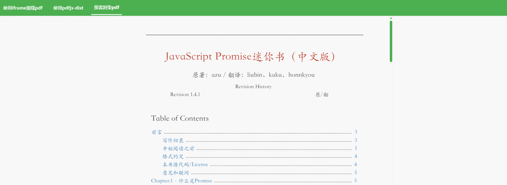
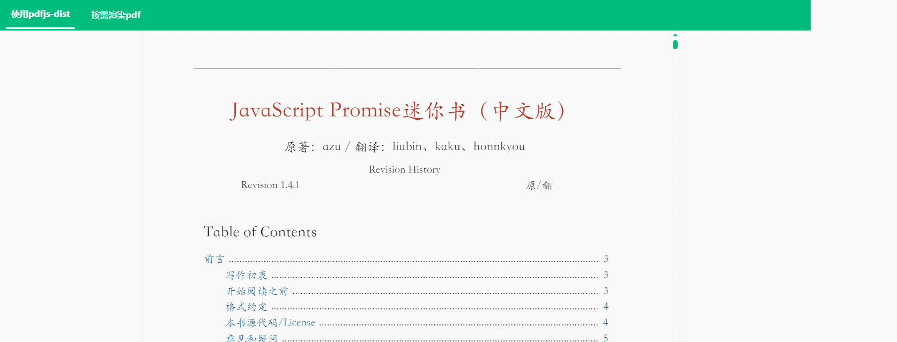
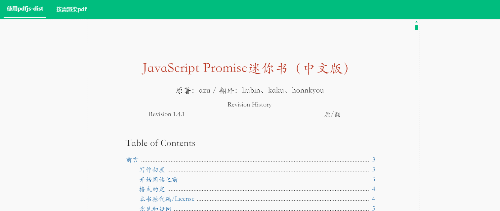
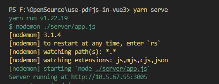
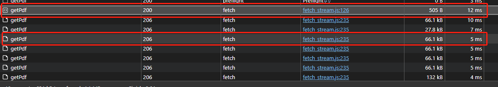
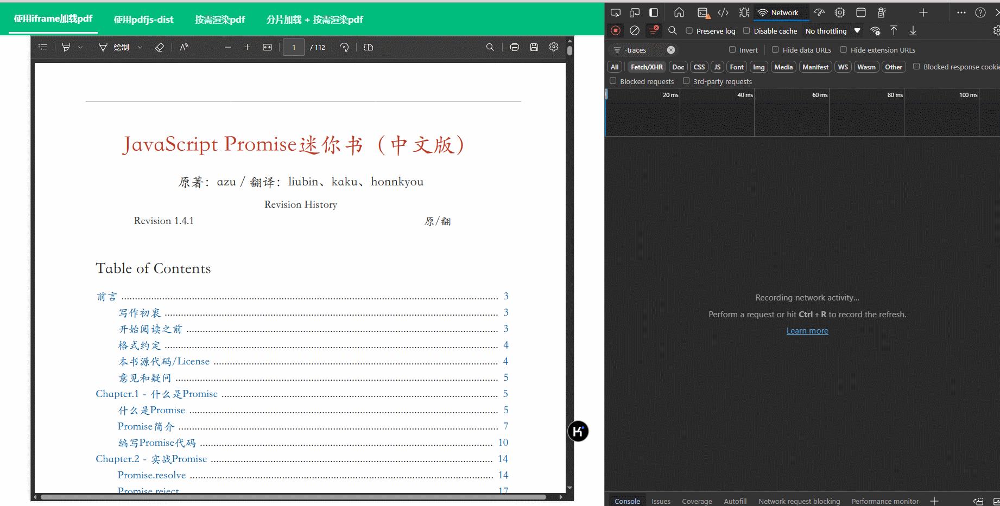

<center>

# 🎉How to Use Pdfjs-dist in Vue3



中文文档 | [英文文档](./README_EN.md)

</center>

## 摘要

本教程展示了如何在 vue3 中使用 pdfjs-dist 展示 pdf 文件，共提供了 3 个示例，3 种实现方法：

- 直接使用 iframe 展示 pdf，调用浏览器原生能力加载 pdf 文件；
- 基于 pdfjs-dist 进行渲染多页 pdf；
- 基于 pdfjs-dist 按需懒加载渲染多页 pdf；

## 使用 iframe 展示 pdf

```html
<template>
  <div class="iframe-container">
    <iframe :src="PdfBook" style="width: 100%; height: 100%" />
  </div>
</template>

<script setup lang="ts">
  import { ref } from "vue";
  import PdfBook from "@/assets/JavaScript.pdf";
</script>

<style lang="scss" scoped>
  .iframe-container {
    width: calc(100vh - 80px);
    height: 100%;
  }
</style>
```

<center>



</center>

**😊 优点：**

- 使用简单
- 功能丰富

**😢 缺点**

- 基于浏览器原生能力渲染，样式等不可控。

## 使用 pdfjs-dist

### 1. 暴力渲染

直接加载和渲染全部 pdf 页面

```html
<template>
  <div class="pdf-container" ref="pdfContainerRef">
    <canvas
      v-for="pageIndex in pdfPages"
      :id="`pdf-canvas-${pageIndex}`"
      :key="pageIndex"
    />
  </div>
</template>

<script setup lang="ts">
  import * as PDFJS from "pdfjs-dist";
  import * as PdfWorker from "pdfjs-dist/build/pdf.worker.js";
  import { nextTick, onMounted, ref } from "vue";
  import PdfBook from "@/assets/JavaScript.pdf";

  window.pdfjsWorker = PdfWorker;
  let pdfDoc: any = null;
  const pdfPages = ref(0);
  const pdfScale = ref(1.5);
  const pdfContainerRef = ref<HTMLElement | null>(null);

  const loadFile = (url: any) => {
    // 设定pdfjs的 workerSrc 参数
    PDFJS.GlobalWorkerOptions.workerSrc = PdfWorker;
    const loadingTask = PDFJS.getDocument(url);
    loadingTask.promise
      .then(async (pdf: any) => {
        pdf.loadingParams.disableAutoFetch = true;
        pdf.loadingParams.disableStream = true;
        pdfDoc = pdf; // 保存加载的pdf文件流
        pdfPages.value = pdfDoc.numPages; // 获取pdf文件的总页数
        await nextTick(() => {
          renderPage(1); // 将pdf文件内容渲染到canvas
        });
      })
      .catch((error: any) => {
        console.warn(`[upthen] pdfReader loadFile error: ${error}`);
      });
  };

  const renderPage = (num: any) => {
    pdfDoc.getPage(num).then((page: any) => {
      page.cleanup();
      if (pdfContainerRef.value) {
        pdfScale.value = pdfContainerRef.value.clientWidth / page.view[2];
      }
      const canvas: any = document.getElementById(`pdf-canvas-${num}`);
      if (canvas) {
        const ctx = canvas.getContext("2d");
        const dpr = window.devicePixelRatio || 1;
        const bsr =
          ctx.webkitBackingStorePixelRatio ||
          ctx.mozBackingStorePixelRatio ||
          ctx.msBackingStorePixelRatio ||
          ctx.oBackingStorePixelRatio ||
          ctx.backingStorePixelRatio ||
          1;
        const ratio = dpr / bsr;
        const viewport = page.getViewport({ scale: pdfScale.value });
        canvas.width = viewport.width * ratio;
        canvas.height = viewport.height * ratio;
        canvas.style.width = viewport.width + "px";
        canvas.style.height = viewport.height + "px";
        ctx.setTransform(ratio, 0, 0, ratio, 0, 0);
        const renderContext = {
          canvasContext: ctx,
          viewport: viewport,
        };
        page.render(renderContext);
        if (num < pdfPages.value) {
          renderPage(num + 1);
        }
      }
    });
  };

  onMounted(() => {
    loadFile(PdfBook);
  });
</script>

<style scoped>
  .pdf-container {
    height: 100%;
    overflow-y: scroll;
    overflow-x: hidden;
    canvas {
      display: flex;
      flex-direction: column;
      align-items: center;
      justify-content: center;
    }
  }
</style>
```

<center>



</center>

**😊 优点**

- 渲染纯粹的 pdf 页面，无其他附带功能。
- 使用简单，自主可控。

**😢 缺点**

- pdf 文件过大时，渲染性能不佳。

**🎉 适用于**
适用于展示 10 页以下的小型 pdf 文档，使用简单，同时不用考虑太多性能优化的问题。

### 2.<p id="ondemand">懒加载渲染</p>

基于 pdfjs-dist 按需懒加载渲染多页 pdf

```html
<template>
  <div class="on-demand-pdf-container" ref="pdfContainerRef">
    <canvas
      v-for="pageIndex in renderedPages"
      :id="`pdf-canvas-${pageIndex}`"
      :key="pageIndex"
    />
  </div>
</template>

<script setup lang="ts">
  import { nextTick, onMounted, ref, computed, onUnmounted } from "vue";
  import PdfBook from "@/assets/JavaScript.pdf";

  let pdfDoc: any = null;
  const pdfPages = ref(0);
  const pdfScale = ref(1.5);
  const pdfContainerRef = ref<HTMLElement | null>(null);
  const loadedNum = ref(0);
  const preloadNum = computed(() => {
    return pdfPages.value - loadedNum.value > 3
      ? 3
      : pdfPages.value - loadedNum.value;
  });
  const loadFished = computed(() => {
    const loadFinished = loadedNum.value + preloadNum.value >= pdfPages.value;
    if (loadFinished) {
      removeEventListeners();
    }
    return loadFinished;
  });

  const renderedPages = computed(() => {
    return loadFished.value
      ? pdfPages.value
      : loadedNum.value + preloadNum.value;
  });

  let loadingTask;
  const renderPage = (num: any) => {
    pdfDoc.getPage(num).then((page: any) => {
      page.cleanup();
      if (pdfContainerRef.value) {
        pdfScale.value = pdfContainerRef.value.clientWidth / page.view[2];
      }
      const canvas: any = document.getElementById(`pdf-canvas-${num}`);
      if (canvas) {
        const ctx = canvas.getContext("2d");
        const dpr = window.devicePixelRatio || 1;
        const bsr =
          ctx.webkitBackingStorePixelRatio ||
          ctx.mozBackingStorePixelRatio ||
          ctx.msBackingStorePixelRatio ||
          ctx.oBackingStorePixelRatio ||
          ctx.backingStorePixelRatio ||
          1;
        const ratio = dpr / bsr;
        const viewport = page.getViewport({ scale: pdfScale.value });
        canvas.width = viewport.width * ratio;
        canvas.height = viewport.height * ratio;
        canvas.style.width = viewport.width + "px";
        canvas.style.height = viewport.height + "px";
        ctx.setTransform(ratio, 0, 0, ratio, 0, 0);
        const renderContext = {
          canvasContext: ctx,
          viewport: viewport,
        };
        page.render(renderContext);
        if (num < loadedNum.value + preloadNum.value && !loadFished.value) {
          renderPage(num + 1);
        } else {
          loadedNum.value = loadedNum.value + preloadNum.value;
        }
      }
    });
  };

  const initPdfLoader = async (loadingTask: any) => {
    return new Promise((resolve, reject) => {
      loadingTask.promise
        .then((pdf: any) => {
          pdf.loadingParams.disableAutoFetch = true;
          pdf.loadingParams.disableStream = true;
          pdfDoc = pdf; // 保存加载的pdf文件流
          pdfPages.value = pdfDoc.numPages; // 获取pdf文件的总页数
          resolve(true);
        })
        .catch((error: any) => {
          reject(error);
          console.warn(`[upthen] pdfReader loadFile error: ${error}`);
        });
    });
  };

  const distanceToBottom = ref(0);
  const calculateDistanceToBottom = () => {
    if (pdfContainerRef.value) {
      const containerHeight = pdfContainerRef.value.offsetHeight;
      const containerScrollHeight = pdfContainerRef.value.scrollHeight;
      distanceToBottom.value =
        containerScrollHeight -
        containerHeight -
        pdfContainerRef.value.scrollTop;
      console.log(distanceToBottom.value);
    }
  };

  const lazyRenderPdf = () => {
    calculateDistanceToBottom();
    if (distanceToBottom.value < 1000) {
      renderPage(loadedNum.value);
    }
  };

  const removeEventListeners = () => {
    pdfContainerRef.value?.removeEventListener("scroll", () => {
      lazyRenderPdf();
    });
  };

  onMounted(async () => {
    // 设定pdfjs的 workerSrc 参数
    let PDFJS = await import("pdfjs-dist");
    window.pdfjsWorker = await import("pdfjs-dist/build/pdf.worker.js");
    PDFJS.GlobalWorkerOptions.workerSrc = window.pdfjsWorker;
    loadingTask = PDFJS.getDocument(PdfBook);
    if (await initPdfLoader(loadingTask)) {
      renderPage(1);
    }

    pdfContainerRef.value.addEventListener("scroll", () => {
      lazyRenderPdf();
    });
  });

  onUnmounted(() => {
    removeEventListeners();
  });
</script>

<style lang="scss" scoped>
  .on-demand-pdf-container {
    height: 100%;
    overflow-y: scroll;
    overflow-x: hidden;
    canvas {
      display: flex;
      flex-direction: column;
      align-items: center;
      justify-content: center;
    }
  }
</style>
```

<center>


</center>

**😊 优点**

- 渲染纯粹的 pdf 页面，无其他附带功能。
- 使用略复杂，自主可控。
- 懒加载渲染，渲染性能更好，使用体验更佳。

**🎉 适用于**

- 可用于展示比较大的 pdf 文件，理论来说，几十到上百兆都不在话下。
- 希望自定义一些简单功能。

## pdfjs-dist 中使用分片加载渲染 pdf

前面提到一些在项目中使用 pdfjs-dist 渲染 pdf 文件的方案，适合渲染页码比较少的 pdf 文件，对于较大的 pdf 文件，比如几十到上百兆，不适合一次性加载，而是需要分片加载。这种方案需要服务端接口配合实现文件的分片。

此前因为受限于个人时间以及后端能力的掌握程度，一直没有实现过这种方案，最近在项目中因为使用以上的方案时，在 pdf 文件较大时，出现了一些性能问题，
不得不回来继续考虑实现 分片加载渲染 pdf 的方式。

得益于 ChatGPT 的发展，我很方便的构建了一个基于 express 的后端服务，并让其帮我实现了 pdf 文件分片的接口。因此终于可以把我一直想补齐的这一块内容实现了。不过，听同事说直接使用 nginx 起个静态代理服务加载 pdf，可以通过 nginx 配置自动实现文件分片，这里不展开研究。

### 1. 服务端支持分片加载

以下是我使用 `ChatGPT` 生成的一个基于 `express` 实现的分片加载 pdf 文件的后端服务代码。

- 分片服务代码代码

```ts
// server/app.js
const express = require("express");
const app = express();
const port = 3005;
const fs = require("fs");
const path = require("path");
const os = require("os");

const setAllowCrossDomainAccess = (app) => {
  app.all("*", (req, res, next) => {
    const { origin, Origin, referer, Referer } = req.headers;
    const allowOrigin = origin || Origin || referer || Referer || "*" || "null";
    res.header("Access-Control-Allow-Origin", allowOrigin);
    res.header(
      "Access-Control-Allow-Headers",
      "traceparent, Content-Type, Authorization, X-Requested-With"
    );
    res.header("Access-Control-Allow-Methods", "PUT,POST,GET,DELETE,OPTIONS");
    res.header("Access-Control-Allow-Credentials", true);
    res.setHeader(
      "Access-Control-Expose-Headers",
      "Accept-Ranges,Content-Range"
    );
    res.header("X-Powered-By", "Express");
    res.header("Accept-Ranges", 65536 * 4);
    if (req.method == "OPTIONS") {
      res.sendStatus(200);
    } else {
      next();
    }
  });
};

setAllowCrossDomainAccess(app);
const CHUNK_SIZE = 1024 * 1024; // 1MB

app.get("/getPdf", (req, res) => {
  console.log("request received", req.headers);

  const filePath = path.join(__dirname, "../src/assets/JavaScript.pdf");
  const stat = fs.statSync(filePath);
  const fileSize = stat.size;
  const range = req.headers.range;

  if (range) {
    const parts = range.replace(/bytes=/, "").split("-");
    const start = parseInt(parts[0], 10);
    const end = parts[1] ? parseInt(parts[1], 10) : fileSize - 1;
    const chunkSize = end - start + 1;

    res.writeHead(206, {
      "Content-Range": `bytes ${start}-${end}/${fileSize}`,
      "Accept-Ranges": "bytes",
      "Content-Length": chunkSize,
      "Content-Type": "application/octet-stream",
    });

    const fileStream = fs.createReadStream(filePath, { start, end });
    fileStream.pipe(res);
  } else {
    res.writeHead(200, {
      "Content-Length": fileSize,
      "Accept-Ranges": "bytes",
      "Content-Type": "application/pdf",
    });

    const fileStream = fs.createReadStream(filePath);
    fileStream.pipe(res);
  }
});

function getLocalIpAddress() {
  const interfaces = os.networkInterfaces();
  for (const interfaceName in interfaces) {
    const addresses = interfaces[interfaceName];
    for (const address of addresses) {
      if (address.family === "IPv4" && !address.internal) {
        return address.address;
      }
    }
  }
  return "localhost";
}

function startServer(port) {
  const server = app.listen(port, () => {
    const ipAddress = getLocalIpAddress();
    console.log(`Server running at http://${ipAddress}:${port}`);
  });

  server.on("error", (err) => {
    if (err.code === "EADDRINUSE") {
      console.log(`Port ${port} is already in use. Trying the next port...`);
      startServer(port + 1);
    } else {
      console.error(err);
    }
  });
}

startServer(port);
```

- 执行以下命令启动该服务

```bash
pnpm run serve
```



调用这个服务时，如果已经正常支持了分片加载，则它的网络请求大概会是这个样子。



如图所示，这里首先会有一个状态码为 200 的请求，该响应的 Content-Length 会返回该文件的整体尺寸，图中的是 1272413
然后紧接着会返回文件的分片内容，其状态码为 206 Partial Content，Content-Length 为客户端请求时每个分片的尺寸大小，一般是 65536.然后 Content-Range 返回当前分片在整个文件中的范围。

### 2. 前端请求支持懒加载

这里基于 pdfjs-dist 去实现前端的渲染，整体实现基于 <a href="ondemand">按需懒加载</a> 部分代码去做。

之前实现都是将文件全部加载下来之后再渲染，其中一个重点内容就是 `PDF.getDocument(url)` 这部分内容。
这部分是用来获取 pdf 文件资源的。使用时，将文件服务地址，本地文件引用或一个文件流转化的 Unit8Array 作为 url。

懒加载 pdf 分片内容，意味着不能再使用以前传全量的文件流的方式。需要使用传递文件服务地址的方式，把请求文件交给 pdfjs-dist 内部去处理，也就是如下这种方式。

```ts
loadingTask = PDFJS.getDocument("http://10.5.67.55:3005");
```

但是这个方式写存在 2 个问题：

- 我的文件服务不是裸奔的，需要携带 token，需要设置其他的响应头等参数，这些该如何做？
- pdfjs-dist 支持懒加载需要设置 2 个参数：disableAutoFetch 和 disableStream，又该在哪里配置？

这 2 个问题在网上都没知道答案，但我知道 pdfjs-dist 肯定是支持的，因为全量使用 pdfjs 这个库时是可以这样做的，而 pdfjs-dist 是 pdfjs 的核心库。带着我的疑惑，我去阅读了这个核心库的源码，找到了 `getDocument()` 这个 api 的具体实现。

😜 还是先给答案吧,源码什么的,感兴趣的接着看就可以了.

通过阅读 getDocument api 发现，这个方法大致的流程就 2 步

- 接收一个 src 参数;
- 基于 src 和默认参数配置，生成 worker;
- 基于 worker 返回 promise 任务异步处理文件加载;

src 支持传一个对象，可传入 `url`、`httpHeader`、`disableAutoFetch`、`disableStream`、`rangeChunkSize` 等参数。

基于以上，我们的实现方案就呼之欲出了。对前文所述方案进行简单改造：

```ts
onMounted(async () => {
  ....
  // getDocument 这里不止可以传一个 url， 还可以传一个对象，如果请求需要带header，可以这样传
  loadingTask = PDFJS.getDocument({
    url: "http://10.5.67.55:3005/getPdf",
    httpHeaders: { Authorization: "Bearer 123" },
    // 以下2个配置需要显式配置为true
    disableAutoFetch: true,
    disableStream: true,
  });
  ....
});
```

需要注意的是，在启用 `disableAutoFetch` 时，同时要启用 `disableStream`, 这 2 个属性默认是 `false`, 需要配置启用。

感兴趣的同学,可以一起看一下这块的源码实现,这个 api 实现比较长，可先大致阅读一下，再重点分析我们关注的内容。

<details markdown="1">
  <summary>点击展开/折叠代码</summary>
  
```ts
// build/pdf.js
function getDocument(src) {
  var task = new PDFDocumentLoadingTask(); // 一个文档加载的实例，是个 promise，意味着可以异步去加载文件
  var source;
  // 这里可以看到，getDocument 支持的参数有 4 种类型，之前一直以为只有 1 种😂
  if (typeof src === "string" || src instanceof URL) {
    source = {
      url: src,
    };
  } else if ((0, _util.isArrayBuffer)(src)) {
    source = {
      data: src,
    };
  } else if (src instanceof PDFDataRangeTransport) {
    source = {
      range: src,
    };
  } else {
    if (_typeof(src) !== "object") {
      throw new Error(
        "Invalid parameter in getDocument, " +
          "need either string, URL, Uint8Array, or parameter object."
      );
    }

    if (!src.url && !src.data && !src.range) {
      throw new Error(
        "Invalid parameter object: need either .data, .range or .url"
      );
    }

    source = src;

}

var params = Object.create(null);
var rangeTransport = null,
worker = null;

// 一个 for 循环设置一些参数
for (var key in source) {
var value = source[key];

    switch (key) {
      case "url":
        if (typeof window !== "undefined") {
          try {
            params[key] = new URL(value, window.location).href;
            continue;
          } catch (ex) {
            (0, _util.warn)('Cannot create valid URL: "'.concat(ex, '".'));
          }
        } else if (typeof value === "string" || value instanceof URL) {
          params[key] = value.toString();
          continue;
        }

        throw new Error(
          "Invalid PDF url data: " +
            "either string or URL-object is expected in the url property."
        );

      case "range":
        rangeTransport = value;
        continue;

      case "worker":
        worker = value;
        continue;

      case "data":
        if (
          _is_node.isNodeJS &&
          typeof Buffer !== "undefined" &&
          value instanceof Buffer
        ) {
          params[key] = new Uint8Array(value);
        } else if (value instanceof Uint8Array) {
          break;
        } else if (typeof value === "string") {
          params[key] = (0, _util.stringToBytes)(value);
        } else if (
          _typeof(value) === "object" &&
          value !== null &&
          !isNaN(value.length)
        ) {
          params[key] = new Uint8Array(value);
        } else if ((0, _util.isArrayBuffer)(value)) {
          params[key] = new Uint8Array(value);
        } else {
          throw new Error(
            "Invalid PDF binary data: either typed array, " +
              "string, or array-like object is expected in the data property."
          );
        }

        continue;
    }

    params[key] = value;

}

// 可以看到这里有超多自定义参数，理论上都是可以通过 getDocument api 传参实现的
params.rangeChunkSize = params.rangeChunkSize || DEFAULT_RANGE_CHUNK_SIZE;
params.CMapReaderFactory =
params.CMapReaderFactory || DefaultCMapReaderFactory;
params.ignoreErrors = params.stopAtErrors !== true;
params.fontExtraProperties = params.fontExtraProperties === true;
params.pdfBug = params.pdfBug === true;
params.enableXfa = params.enableXfa === true;

if (
typeof params.docBaseUrl !== "string" ||
(0, \_display_utils.isDataScheme)(params.docBaseUrl)
) {
params.docBaseUrl = null;
}

if (!Number.isInteger(params.maxImageSize)) {
params.maxImageSize = -1;
}

if (typeof params.isEvalSupported !== "boolean") {
params.isEvalSupported = true;
}

if (typeof params.disableFontFace !== "boolean") {
params.disableFontFace =
\_api_compatibility.apiCompatibilityParams.disableFontFace || false;
}

if (typeof params.ownerDocument === "undefined") {
params.ownerDocument = globalThis.document;
}

if (typeof params.disableRange !== "boolean") {
params.disableRange = false;
}

// 禁止流式加载
if (typeof params.disableStream !== "boolean") {
params.disableStream = false;
}
// 禁止自动加载
if (typeof params.disableAutoFetch !== "boolean") {
params.disableAutoFetch = false;
}

(0, \_util.setVerbosityLevel)(params.verbosity);

if (!worker) {
var workerParams = {
verbosity: params.verbosity,
port: \_worker_options.GlobalWorkerOptions.workerPort,
};
worker = workerParams.port
? PDFWorker.fromPort(workerParams)
: new PDFWorker(workerParams);
task.\_worker = worker;
}

var docId = task.docId;
worker.promise
.then(function () {
if (task.destroyed) {
throw new Error("Loading aborted");
}

      var workerIdPromise = _fetchDocument(
        worker,
        params,
        rangeTransport,
        docId
      );

      var networkStreamPromise = new Promise(function (resolve) {
        var networkStream;

        if (rangeTransport) {
          networkStream = new _transport_stream.PDFDataTransportStream(
            {
              length: params.length,
              initialData: params.initialData,
              progressiveDone: params.progressiveDone,
              contentDispositionFilename: params.contentDispositionFilename,
              disableRange: params.disableRange,
              disableStream: params.disableStream,
            },
            rangeTransport
          );
        } else if (!params.data) {
          // 如何设置响应头，这里找到答案了
          // 果然提供了 httpHeaders 参数供用户定制
          networkStream = createPDFNetworkStream({
            url: params.url,
            length: params.length,
            httpHeaders: params.httpHeaders,
            withCredentials: params.withCredentials,
            rangeChunkSize: params.rangeChunkSize,
            disableRange: params.disableRange,
            disableStream: params.disableStream,
          });
        }

        resolve(networkStream);
      });
      return Promise.all([workerIdPromise, networkStreamPromise]).then(
        function (_ref) {
          var _ref2 = _slicedToArray(_ref, 2),
            workerId = _ref2[0],
            networkStream = _ref2[1];

          if (task.destroyed) {
            throw new Error("Loading aborted");
          }

          var messageHandler = new _message_handler.MessageHandler(
            docId,
            workerId,
            worker.port
          );
          messageHandler.postMessageTransfers = worker.postMessageTransfers;
          var transport = new WorkerTransport(
            messageHandler,
            task,
            networkStream,
            params
          );
          task._transport = transport;
          messageHandler.send("Ready", null);
        }
      );
    })
    ["catch"](task._capability.reject);

return task;
}

```

</details>

根据以上源码,很容易可以得到我们的解决方案了。以上，分片加载 pdf 的方案就完成了。

### 3. 效果演示



## 性能比较

### 1. 性能比较

以下针对上面的几种方案做一个性能比较

测试文档：112 页，开发环境测试，本地一次性加载文件，不考虑各类其他性能优化手段。

- 无懒加载


- 懒加载


✨ 以上 2 种是在一次性请求完全部文件流后进行 pdf 渲染

- 从服务端分片加载文件，分片大小设为 1024 字节


### 2. 结论

- 超小型文件（10 页之类）：可不考虑懒加载
- 小型到中型文件（5 - 20M）: 需要考虑懒加载，可不分片
- 大型文件 （20 - 几百兆）：一定需要分片了，同时要考虑其他性能优化手段，如页数过多时需要动态移出一些不可见的页数，以免造成页面卡顿。

## 写在后面

pdf 相关特性还有很多，这里仅列出常用的一些使用方法，以后有时间的话会解锁更多相关教程。

## 相关博客

[vue3 中如何使用 pdfjs 来展示 pdf 文档](https://juejin.cn/post/7277475232320536633#heading-18)

## 参考资料

- [pdf.js 源码](ttps://github.com/mozilla/pdf.js)
- [pdf.js 官方文档](https://mozilla.github.io/pdf.js/)

## License

该项目采用 MIT 许可协议。
```
