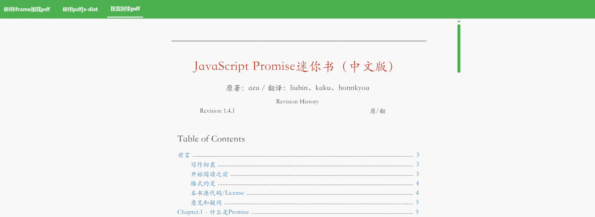
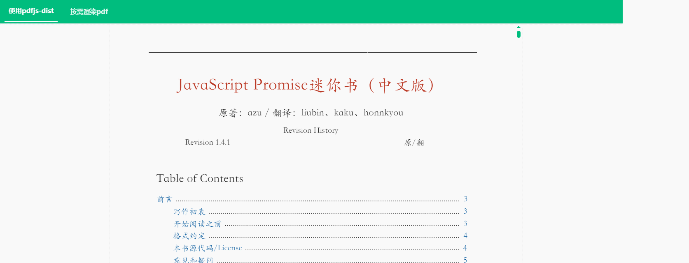
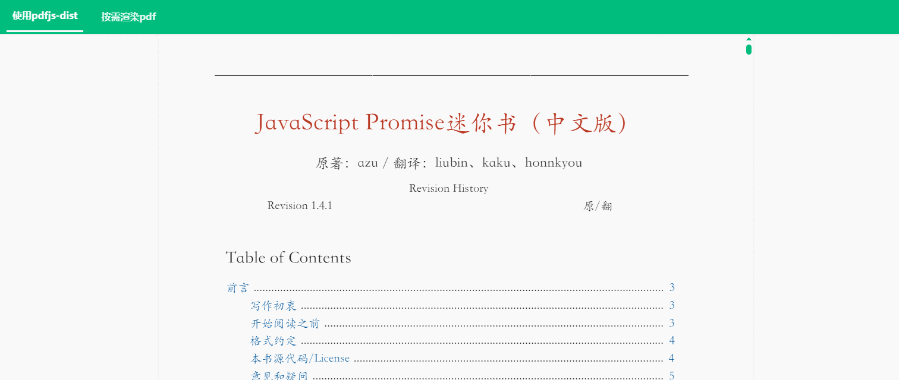

<center>

# 🎉How to Use Pdfjs-dist in Vue3



English Documentation | [Chinese Documentation](./README.md)


</center>


## Abstract

This tutorial demonstrates how to use pdfjs-dist to display PDF files in Vue3, providing three examples with three implementation methods:

- Directly use iframe to display PDF, calling the browser's native ability to load PDF files;
- Based on pdfjs-dist to render multi-page PDF;
- Based on pdfjs-dist to render multi-page PDF on-demand with lazy loading.

## Using Iframe to Display PDF

```html
<template>
  <div class="iframe-container">
    <iframe :src="PdfBook" style="width: 100%; height: 100%" />
  </div>
</template>

<script setup lang="ts">
  import { ref } from "vue";
  import PdfBook from "@/assets/JavaScript.pdf";
</script>

<style lang="scss" scoped>
  .iframe-container {
    width: calc(100vh - 80px);
    height: 100%;
  }
</style>
```

<center>



</center>

**Advantages:**

- Simple to use
- Rich in features

**Disadvantages:**

- Based on the browser's native ability to render, the style and other aspects are not controllable.

## Using Pdfjs-dist

### 1. Brute Force Rendering

Directly load and render all PDF pages

```html
<template>
  <div class="pdf-container" ref="pdfContainerRef">
    <canvas
      v-for="pageIndex in pdfPages"
      :id="`pdf-canvas-${pageIndex}`"
      :key="pageIndex"
    />
  </div>
</template>

<script setup lang="ts">
  import * as PDFJS from "pdfjs-dist";
  import * as PdfWorker from "pdfjs-dist/build/pdf.worker.js";
  import { nextTick, onMounted, ref } from "vue";
  import PdfBook from "@/assets/JavaScript.pdf";

  window.pdfjsWorker = PdfWorker;
  let pdfDoc: any = null;
  const pdfPages = ref(0);
  const pdfScale = ref(1.5);
  const pdfContainerRef = ref<HTMLElement | null>(null);

  const loadFile = (url: any) => {
    // 设定pdfjs的 workerSrc 参数
    PDFJS.GlobalWorkerOptions.workerSrc = PdfWorker;
    const loadingTask = PDFJS.getDocument(url);
    loadingTask.promise
      .then(async (pdf: any) => {
        pdf.loadingParams.disableAutoFetch = true;
        pdf.loadingParams.disableStream = true;
        pdfDoc = pdf; // 保存加载的pdf文件流
        pdfPages.value = pdfDoc.numPages; // 获取pdf文件的总页数
        await nextTick(() => {
          renderPage(1); // 将pdf文件内容渲染到canvas
        });
      })
      .catch((error: any) => {
        console.warn(`[upthen] pdfReader loadFile error: ${error}`);
      });
  };

  const renderPage = (num: any) => {
    pdfDoc.getPage(num).then((page: any) => {
      page.cleanup();
      if (pdfContainerRef.value) {
        pdfScale.value = pdfContainerRef.value.clientWidth / page.view[2];
      }
      const canvas: any = document.getElementById(`pdf-canvas-${num}`);
      if (canvas) {
        const ctx = canvas.getContext("2d");
        const dpr = window.devicePixelRatio || 1;
        const bsr =
          ctx.webkitBackingStorePixelRatio ||
          ctx.mozBackingStorePixelRatio ||
          ctx.msBackingStorePixelRatio ||
          ctx.oBackingStorePixelRatio ||
          ctx.backingStorePixelRatio ||
          1;
        const ratio = dpr / bsr;
        const viewport = page.getViewport({ scale: pdfScale.value });
        canvas.width = viewport.width * ratio;
        canvas.height = viewport.height * ratio;
        canvas.style.width = viewport.width + "px";
        canvas.style.height = viewport.height + "px";
        ctx.setTransform(ratio, 0, 0, ratio, 0, 0);
        const renderContext = {
          canvasContext: ctx,
          viewport: viewport,
        };
        page.render(renderContext);
        if (num < pdfPages.value) {
          renderPage(num + 1);
        }
      }
    });
  };

  onMounted(() => {
    loadFile(PdfBook);
  });
</script>

<style scoped>
  .pdf-container {
    height: 100%;
    overflow-y: scroll;
    overflow-x: hidden;
    canvas {
      display: flex;
      flex-direction: column;
      align-items: center;
      justify-content: center;
    }
  }
</style>
```

<center>



</center>

**Advantages:**

- Renders pure PDF pages without additional features.
- Simple to use and fully controllable.

**Disadvantages:**

- Poor rendering performance when the PDF file is too large.

**Applicable to:**
Suitable for displaying small PDF documents with less than 10 pages. It's simple to use and does not require considering too many performance optimization issues.

### 2. Lazy Loading Rendering

Based on pdfjs-dist, render multi-page PDF with on-demand lazy loading

```html
<template>
  <div class="on-demand-pdf-container" ref="pdfContainerRef">
    <canvas
      v-for="pageIndex in renderedPages"
      :id="`pdf-canvas-${pageIndex}`"
      :key="pageIndex"
    />
  </div>
</template>

<script setup lang="ts">
  import { nextTick, onMounted, ref, computed, onUnmounted } from "vue";
  import PdfBook from "@/assets/JavaScript.pdf";

  let pdfDoc: any = null;
  const pdfPages = ref(0);
  const pdfScale = ref(1.5);
  const pdfContainerRef = ref<HTMLElement | null>(null);
  const loadedNum = ref(0);
  const preloadNum = computed(() => {
    return pdfPages.value - loadedNum.value > 3
      ? 3
      : pdfPages.value - loadedNum.value;
  });
  const loadFished = computed(() => {
    const loadFinished = loadedNum.value + preloadNum.value >= pdfPages.value;
    if (loadFinished) {
      removeEventListeners();
    }
    return loadFinished;
  });

  const renderedPages = computed(() => {
    return loadFished.value
      ? pdfPages.value
      : loadedNum.value + preloadNum.value;
  });

  let loadingTask;
  const renderPage = (num: any) => {
    pdfDoc.getPage(num).then((page: any) => {
      page.cleanup();
      if (pdfContainerRef.value) {
        pdfScale.value = pdfContainerRef.value.clientWidth / page.view[2];
      }
      const canvas: any = document.getElementById(`pdf-canvas-${num}`);
      if (canvas) {
        const ctx = canvas.getContext("2d");
        const dpr = window.devicePixelRatio || 1;
        const bsr =
          ctx.webkitBackingStorePixelRatio ||
          ctx.mozBackingStorePixelRatio ||
          ctx.msBackingStorePixelRatio ||
          ctx.oBackingStorePixelRatio ||
          ctx.backingStorePixelRatio ||
          1;
        const ratio = dpr / bsr;
        const viewport = page.getViewport({ scale: pdfScale.value });
        canvas.width = viewport.width * ratio;
        canvas.height = viewport.height * ratio;
        canvas.style.width = viewport.width + "px";
        canvas.style.height = viewport.height + "px";
        ctx.setTransform(ratio, 0, 0, ratio, 0, 0);
        const renderContext = {
          canvasContext: ctx,
          viewport: viewport,
        };
        page.render(renderContext);
        if (num < loadedNum.value + preloadNum.value && !loadFished.value) {
          renderPage(num + 1);
        } else {
          loadedNum.value = loadedNum.value + preloadNum.value;
        }
      }
    });
  };

  const initPdfLoader = async (loadingTask: any) => {
    return new Promise((resolve, reject) => {
      loadingTask.promise
        .then((pdf: any) => {
          pdf.loadingParams.disableAutoFetch = true;
          pdf.loadingParams.disableStream = true;
          pdfDoc = pdf; // 保存加载的pdf文件流
          pdfPages.value = pdfDoc.numPages; // 获取pdf文件的总页数
          resolve(true);
        })
        .catch((error: any) => {
          reject(error);
          console.warn(`[upthen] pdfReader loadFile error: ${error}`);
        });
    });
  };

  const distanceToBottom = ref(0);
  const calculateDistanceToBottom = () => {
    if (pdfContainerRef.value) {
      const containerHeight = pdfContainerRef.value.offsetHeight;
      const containerScrollHeight = pdfContainerRef.value.scrollHeight;
      distanceToBottom.value =
        containerScrollHeight -
        containerHeight -
        pdfContainerRef.value.scrollTop;
      console.log(distanceToBottom.value);
    }
  };

  const lazyRenderPdf = () => {
    calculateDistanceToBottom();
    if (distanceToBottom.value < 1000) {
      renderPage(loadedNum.value);
    }
  };

  const removeEventListeners = () => {
    pdfContainerRef.value?.removeEventListener("scroll", () => {
      lazyRenderPdf();
    });
  };

  onMounted(async () => {
    // 设定pdfjs的 workerSrc 参数
    let PDFJS = await import("pdfjs-dist");
    window.pdfjsWorker = await import("pdfjs-dist/build/pdf.worker.js");
    PDFJS.GlobalWorkerOptions.workerSrc = window.pdfjsWorker;
    loadingTask = PDFJS.getDocument(PdfBook);
    if (await initPdfLoader(loadingTask)) {
      renderPage(1);
    }

    pdfContainerRef.value.addEventListener("scroll", () => {
      lazyRenderPdf();
    });
  });

  onUnmounted(() => {
    removeEventListeners();
  });
</script>

<style lang="scss" scoped>
  .on-demand-pdf-container {
    height: 100%;
    overflow-y: scroll;
    overflow-x: hidden;
    canvas {
      display: flex;
      flex-direction: column;
      align-items: center;
      justify-content: center;
    }
  }
</style>
```

<center>


</center>

**Advantages:**

- Renders pure PDF pages without additional features.
- Slightly more complex to use, but fully controllable.
- Lazy loading rendering, better rendering performance, and improved user experience.

**Applicable to:**

- Suitable for displaying larger PDF files, theoretically, tens to hundreds of megabytes are not a problem.
- For those who wish to customize some simple features.

## Postscript

There are many more features related to PDF. This article only lists some commonly used methods. If I have time in the future, I will unlock more related tutorials.

### 3. Performance Comparison

After implementing lazy loading of PDF pages, the performance has been greatly improved.

Test Document: 112 pages, tested in the development environment, the file is loaded all at once locally, without considering other performance optimization methods.

- Without Lazy Loading


- With Lazy Loading


✨ The above examples render the PDF after requesting the entire file stream at once, hence the performance is affected by the size of the PDF file. In a production environment, it is possible to work with the server to request byte streams on demand and combine them with on-demand rendering to achieve better rendering performance.

## Related Blogs

[How to Use Pdfjs to Display PDF in Vue3](https://juejin.cn/post/7277475232320536633#heading-18)

## References

- [Pdf.js Source Code](https://github.com/mozilla/pdf.js)
- [Pdf.js Official Documentation](https://mozilla.github.io/pdf.js/)

## License

This project is licensed under the MIT License.

---

## Disclaimer

This document has been assisted by AIGC in translation; please refer to the source code for specific details and accuracy.
